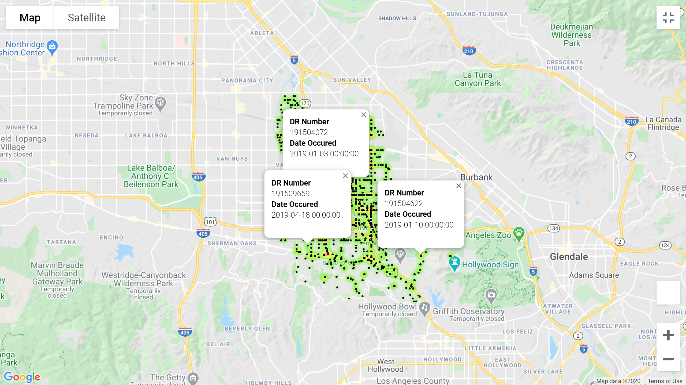

# Incident Mapping
## Goals
1. Map all the incidents to a Google Map. Add info boxes for each marker. 

2. Create heatmap, with locations that have multiple incidents weighted higher.

### Sample map created

