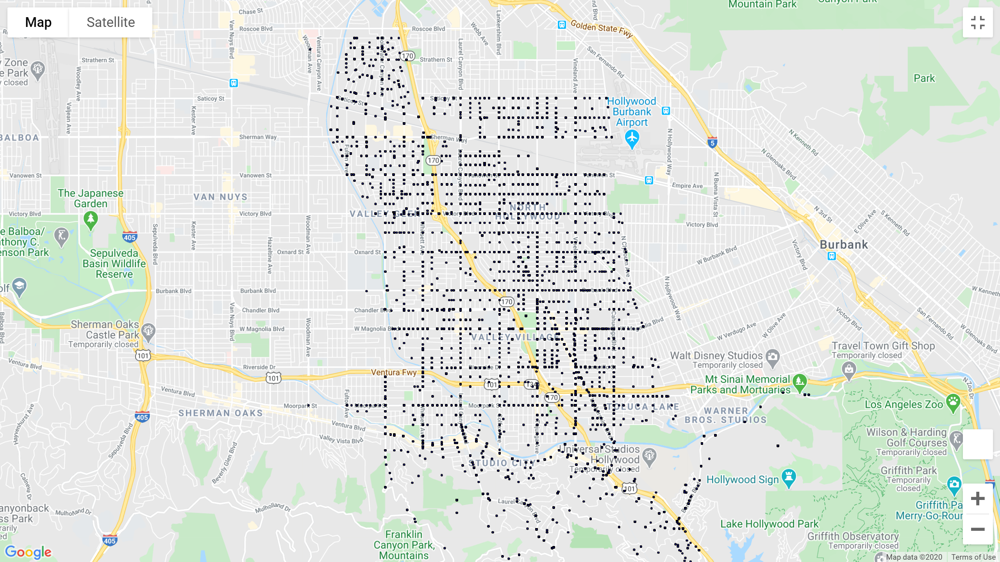
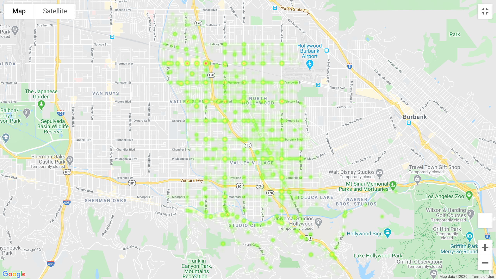
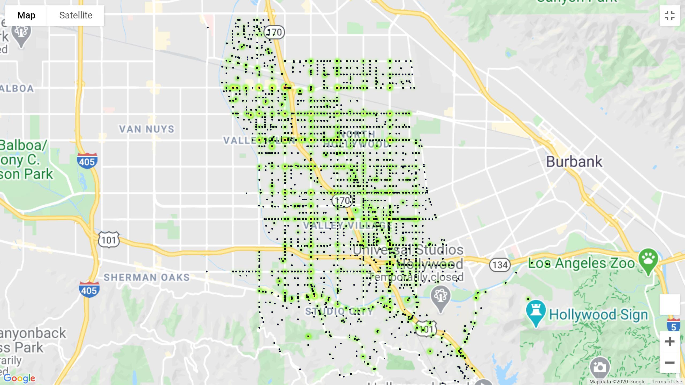

# UCI Data Analytics Bootcamp 2020 - Team Project 1

First group project

Members are Andrea Rosenberger, Arezo (Zoey) Charif, Stephen Yang.

## Proposal

### Traffic Collisions in Los Angeles

Our project seeks to uncover patterns among traffic accidents in Los Angeles (North Hollywood), utilizing traffic collision data provided by the LAPD. We will uncover patterns and correlations among location frequency, changes over time and major events type of collision in major hotspots, and present statistics, charts, maps to illustrate our results. 

Our study may be useful to city officials, planners, and engineers to design and implement infrastructural changes to reduce or eliminate future accidents.

## Sources and references

- Datasource is from the city of Los Angeles. Found at:
  https://data.lacity.org/A-Safe-City/Traffic-Collision-Data-from-2010-to-Present/d5tf-ez2w
  
- LA city API info:
  https://dev.socrata.com/foundry/data.lacity.org/d5tf-ez2w
  
## Current Status

- Data has been cleaned.
- We have maps!

Incidents

Heat map

Combined

## To-do
- Determine the X top hotspots
- Determine the X most common Modus Operandi (MO)
- Statistical plotting and possible conclusions
